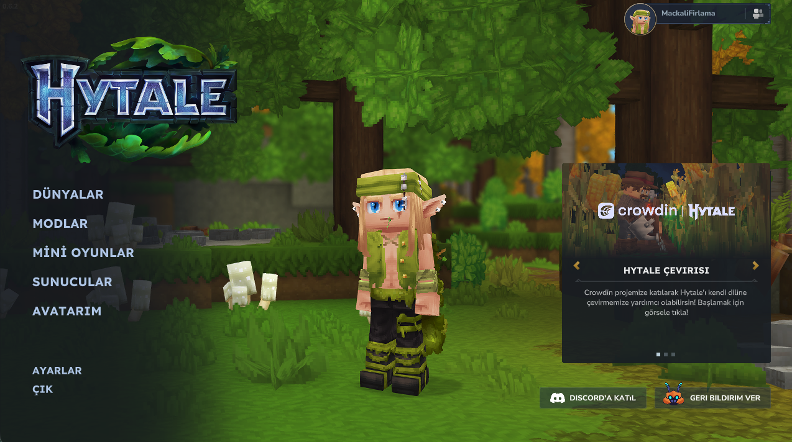
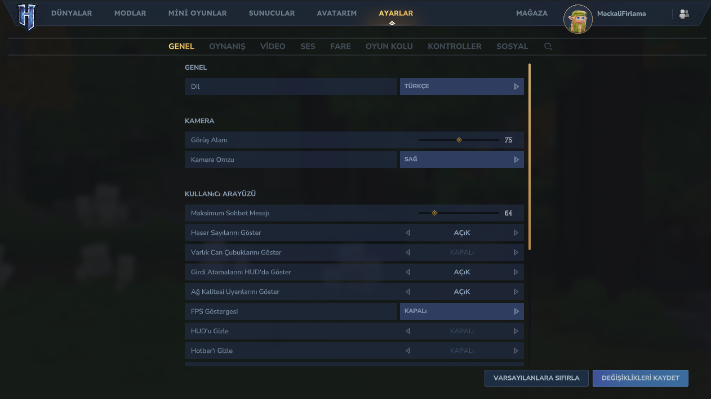
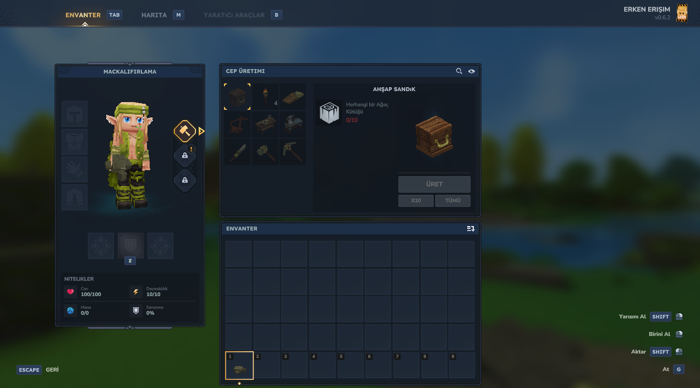
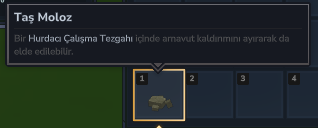
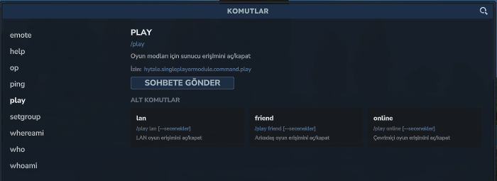

# Hytale Türkçe Çeviri Full


Hytale'i **baştan sona Türkçeleştirir**: ana menü, ayarlar, dünyalar, sunucular,
avatar, envanter, tooltip'ler, inşaatçı/editör araçları **ve** oyun içi tüm
metinler (eşya/blok adları, açıklamalar, ~2800 komut, NPC'ler, dünya, hatıralar,
geçitler, avatar özelleştirme).

| Katman | Kapsam |
|---|---|
| Oyun içi (`server.lang`, 11009 anahtar) | ✅ ~%99 (kalan = fantezi özel adlar + kod şablonları) |
| Menü / arayüz (`client.lang`, ~3480 anahtar) | ✅ %100 çevrilebilir içerik (kalan = klavye tuşları, `x10`/`ms`, marka terimleri) |
| Avatar özelleştirme (`Common/`, 22 dosya) | ✅ ~%98 (kalan = Viking, Afro gibi ödünç kelimeler) |

**Sürüm:** v1.0.0 · Windows + macOS.
Üç katmanda da 0 eksik anahtar, 0 bozuk satır, 0 placeholder/etiket hatası.

---

## Ekran görüntüleri

Gerçek oyun içi görüntüler — `gorseller/ekran-goruntuleri/`

| Ana Menü | Ayarlar | Envanter / Üretim |
|---|---|---|
|  |  |  |

| Eşya Tooltip'i | Komutlar |
|---|---|
|  |  |

---

## Kurulum (son kullanıcı)

**İndir:** `dagitim/` klasörü (veya GitHub release zip'i).

- **Windows:** `KUR-Windows.bat` → çift tıkla
- **macOS:** `KUR-Mac.command` → çift tıkla (ilk sefer sağ tık → Aç)
- Ayrıntı: `dagitim/OKUBENI.txt` ve `dagitim/KURULUM-DETAYLI.md`

**Sadece oyun içi çeviri** (menü İngilizce kalsın):
`KLYC-Turkce-Ceviri-v1.0.0.zip` → `UserData/Mods/` → Dünya Ayarları → Modlar → etkinleştir.
(CurseForge'dan da tek tıkla kurulabilir.)

---

## Nasıl çalışır

### 1. Oyun içi metinler — Hytale'in resmi mod sistemi
Sunucu (tek oyuncuda bile çalışır) `UserData/Mods/` içindeki paketlerden
`Server/Languages/tr-TR/server.lang` okur, çeviriyi istemciye gönderir.
İmza sorunu yok, oyun güncellemesine dayanıklı.

```
manifest.json                       Group=KLYC · Name="Türkçe Çeviri Full" · ServerVersion="*"
Server/Languages/tr-TR/server.lang   eşya, blok, komut, NPC, dünya
Common/Languages/tr-TR/...           avatar özelleştirme
```

### 2. Menü metinleri — bundle düzenleme + ad-hoc yeniden imzalama
Menü yazıları oyunun kod imzalı `Hytale.app` çekirdeğindeki `client.lang`
dosyasında. Mod ile değiştirilemez. Yöntem:

1. `Hytale.app/.../Data/Shared/Language/tr-TR/{client.lang,meta.lang}` eklenir
   (`fallback.lang` zaten `tr-CY = tr-TR` içerir → tr-TR tanınan bir yerel).
2. `codesign --force --deep --sign - --preserve-metadata=entitlements` ile oyun
   ad-hoc yeniden imzalanır (entitlement'lar yalnızca ağ + ses, korunur).
3. `Settings.json` → `"Language":"tr-TR"`.
4. Launcher'ın team-id kontrolü yalnızca yama sonrası çalışır, normal açılışta
   değil → sorunsuz.

**Windows'ta** imza duvarı yok — sadece `tr-TR/` klasörünü kopyalamak yeter.

**Risk:** Oyun güncellemesi Client'i yeniden indirir → `tr-TR/` silinir,
Hypixel imzası döner. `KUR` betiği yeniden çalıştırılır (10 sn).

---

## Dağıtım

| Kanal | Ne konur |
|---|---|
| **CurseForge** | Yalnızca **mod paketi** (`.zip`). Menü çevirisi buraya uymaz (oyun dosyası değişimi + yerel imza gerektirir). |
| **GitHub Releases** | Tüm `dagitim/` klasörü — mod + menü çevirisi + kurulum betikleri + dokümanlar. |
| **Doğrudan** | `dagitim/` klasörünü zip'le, gönder. |

Dağıtılan paket **hiçbir Hytale dosyası içermez** — yalnızca özgün çeviri
metinleri + kurulum betikleri. Yeniden imzalama her kullanıcının kendi
makinesinde olur. Hytale EULA çeviri ve modlamaya izin verir.

**Kimlik kilidi:** `Group` (`KLYC`) ve `Name` (`Türkçe Çeviri Full`) **asla
değişmez** — değişirse eski dünyalar "MISSING MOD" verir. Sadece `Version` artar.

Sürüm çıkarma: `./yayinla.sh 1.0.1` — bütünlük kontrolü yapar, zip üretir,
`dagitim/`'e ve `UserData/Mods/`'a kopyalar.

### Geliştiricilere ulaşma
Menü çevirisinin resmi yolu yok. Hypixel'e iletilebilecekler:
- Oyun içi **Geri Bildirim → Çeviri** ile "resmi tr-TR `client.lang` desteği" talebi.
- `client.lang` uppercase dönüşümünün Türkçe `i/İ/ı/I` kurallarını bilmediği bir hata.

---

## Depo yapısı

```
pack/                    çeviri paketinin kaynağı → paketle.sh ile zip'lenir
client-turkce/tr-TR/     menü çevirisi (client.lang + meta.lang) ana kopya
dagitim/                 dağıtıma hazır (Win+Mac): KUR-*, KALDIR-*, mod/, menu/, dokümanlar
kaynak/                  oyunun İngilizce .lang dosyaları (referans; gitignore, DAĞITILMAZ)
_client_yedek/           orijinal Client'in tam yedeği (gitignore)

paketle.sh               pack/ → KLYC-Turkce-Ceviri-vX.Y.Z.zip
yayinla.sh <sürüm>       yeni sürüm: kontrol + paketle + kopyala
test-kur.sh              paketi yerelde UserData/Mods/ içine kurar
ilerleme.py              server.lang çeviri ilerlemesi (%), bölüm bazlı
sozluk.py / desc.py      eşya adı / açıklama yardımcı çeviri araçları
client-turkce-uygula.sh  menü çevirisini oyuna (yeniden) uygular + imzalar
client-geri-al.sh        Client'i yedekten orijinaline döndürür
```

### Çeviri kuralları
- Sadece `=` işaretinin **sağı** çevrilir.
- `{degisken}`, `{count, plural, one {..} other {..}}`, `{x, select, ..}`,
  `<color is="...">`, `<item is="..."/>`, `<msg key="..."/>`, `\n`, `\t` → **aynen** korunur.
- Türkçe tek çoğul biçim: `one {..} other {..}` → ikisi de aynı yazılır.
- Çevrilmeyen anahtar otomatik İngilizce görünür (bozulma olmaz).
- Butonlar/sekmeler oyun tarafından BÜYÜK harfe çevrilir; bu anahtarlar
  `client.lang`'da zaten doğru Türkçe büyük harfle yazılır (GERİ, İPTAL...).

---

## Yapımcı

**Eren KALAYCI** (KLYC)

- 🌐 [ernklyc.dev](https://ernklyc.dev) · [Blog](https://ernklyc.dev/blog)
- 📫 ernklyc@gmail.com
- 💼 [LinkedIn](https://www.linkedin.com/in/erenklyc/) · 🐦 [@ernklycdev](https://x.com/ernklycdev) · 📸 [Instagram](https://www.instagram.com/ernklyc.dev/)
- 📱 [Google Play](https://play.google.com/store/apps/dev?id=6576291249346115918)
- 💻 [github.com/ernklyc](https://github.com/ernklyc)

Yanlış / eksik / taşan çeviri gördüysen ekran görüntüsüyle ulaş — çeviri
sürekli güncelleniyor.

## Lisans
`LISANS.txt` — CC BY 4.0 benzeri: özgürce kullan, paylaş, değiştir; kaynak
göster ("Çeviri: KLYC"), ayrı satma. Paket hiçbir Hytale dosyası içermez.
Ayrıntı için `SURUM-NOTLARI.md`.
